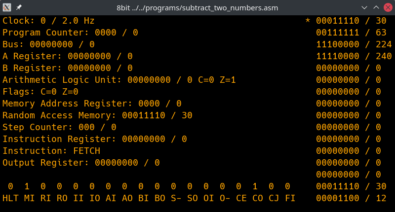

# 8-bit-computer-emulator

This is a C++ based emulator of my [8-bit-computer](https://github.com/blurpy/8-bit-computer).

The goal is to make the emulator as realistic as possible. It's based on emulating the communication between the different parts of the computer so the state is accurate on every cycle. This means the instruction decoder does not change state of memory or registers, but rather directs which part can communicate over the bus at different points in time, like the real hardware do with the microcode in the EEPROMs. Programs that run on the real hardware will run unmodified on the emulator with the same result.

Please see the link above for documentation on how the computer works. Since the emulator tries to replicate that, no additional documentation is provided here.



The column on the right displays the entire contents of the RAM, as well as where the MAR is pointing.


## Requirements

The emulator builds on Linux, macOS and Windows. It is primarily tested on Linux.

* cmake
* gcc/clang/msvc
* sdl2
* sdl2_ttf


### Linux

Ubuntu:

```
sudo apt-get install build-essential cmake libsdl2-dev libsdl2-ttf-dev
```

openSUSE:

```
sudo zypper install cmake-full libSDL2-devel libSDL2_ttf-devel
```


### macOS

Install xcode command line tools:

```
sudo xcode-select --install
```

Install the rest of the tools with [Homebrew](https://brew.sh/):

```
brew install cmake sdl2 sdl2_ttf
```


## Build and run

Clone the repo first with git or download a zip of the repo. Run the following inside the folder with the code:

```
$ mkdir build
$ cd build
$ cmake ..
$ cmake --build .
$ ctest (optional step)
$ cd ..
$ ./build/src/8bit programs/<program.asm>
```


## Programs

Pre-made programs are available in the [programs](programs) directory. Programs are in assembly-format, and the emulator will assemble them into machine code at runtime.

The assembly-format is the same as the real hardware, with a couple of additions to handle the case where you would input data directly into the memory using the DIP-switches.

|Name|Full name|Operand|Description|
|----|---------|-------|-----------|
|ORG|Origin|4-bit memory reference|Changes memory location to the address in the parameter| 
|DB|Define byte|8-bit value|Sets the parameter as a byte in memory at the current memory location|

Example of how to put the value 202 at memory location 15:

```asm
ORG 15
DB  202
```

This is useful to prepare the memory before the program runs, and also the only way to prepare larger numbers since `LDI` only takes a 4-bit value. 


## Keyboard shortcuts

The emulator starts in a stopped state. Use the keyboard to control the emulator.

* `s` start / stop
* `r` restart the program (_when stopped_)
* `space` single step (_when stopped_)
* `+` increase frequency
* `-` decrease frequency


## Included files

These are the external files included in this project:

* [Hack font](https://github.com/source-foundry/Hack)
* [doctest test framework](https://github.com/onqtam/doctest/)
* [FakeIt mock framework](https://github.com/eranpeer/FakeIt)
* [sdl2-cmake-modules](https://github.com/aminosbh/sdl2-cmake-modules)
* [download-sdl2 GitHub Action](https://github.com/albin-johansson/download-sdl2)


## License

This code is licensed under the MIT license. See [LICENSE](LICENSE) for details.
